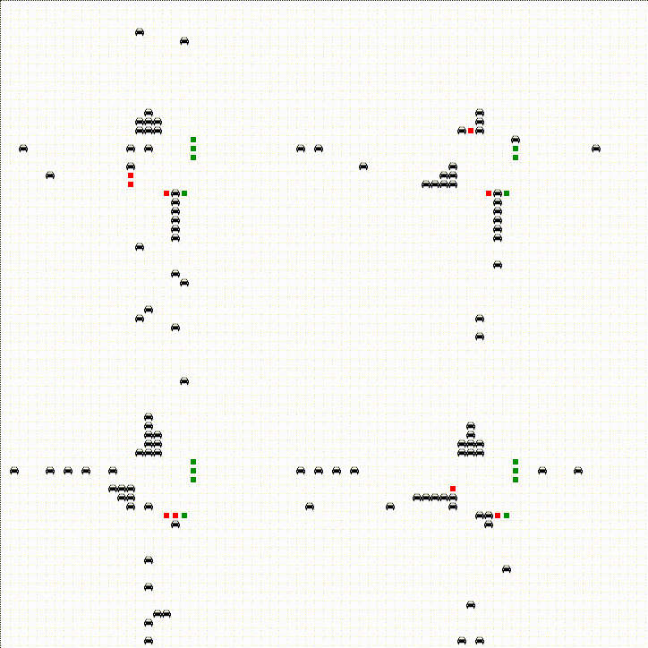

# Pollution reduction by communicating trafficlights

## Overview
This project investigates the pollution reduction by communicating traffic lights in a multi-intersection environment.
The model contains traffic light agents which are able to communicate with each other as well as cars which drive
around by themselves, without any communication. The cars will follow the direction of the lane they are in and will
choose a random lane when they take a turn or go straight at the traffic lights.    
This repository contains code to generate a map with x^2 intersections (roadmapgenerator.py) and code that
 visualizes the environment and runs the simulation (Visualization.py). This script launches a webpage with 
 the visualization.
  
## Scripts
- Generating the map:   
roadmapgenerator.py gridsize streetlength #intersections   
The gridsize corresponds to the size of the grid compared to real life, the street length is the length from 1
intersection to another, the #intersections in the number of intersections. 
The measures are in cm (e.g. a gridsize of 300 is a 3m x 3m grid). The number of intersections needs to be X^2 
where X is an integer. Currently there is only visualization support for a gridsize of 300. This script will generate 
Generatedmap.txt file which will be used for visalization.
- Running the simulation:   
Visualization.py  
This will open a webbrowser with the visualized simulation.
## Future goals
The goal of the model is to test different strategies for traffic light and see if they can reduce pollution by cars.
This will be accomplished by implementing:
- Car characteristics
- Emission for a certain speed and acceleration
- Traffic light tactics

We will also implement live graphs.
